# 检测技术与智能仪表

>注：==荧光标记==为重点部分
## 考试题型
- 填空(10空/10分)
- 选择(10题/10分)
- 判断题(10题/10分)
- 简答(4题/20分)
- 计算题(2题/20分)
- 综合题:实验、计算和分析（1题/30分）

## 绪论
### ==传感器的基本概述==
-   什么是传感器？：能够感受规定的被测量并按照一定的规律转换成可输出信号的器件或装置
-   传感器基本结构：传感器通常由敏感元件、转换元件和转换电路组成。
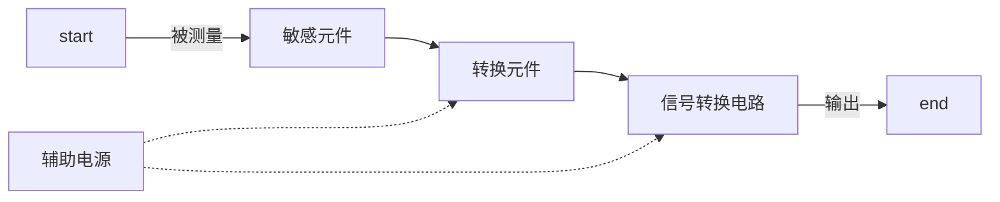
-   传感器的分类：传感器的分类方法很多，但目前一般采用两种分类方法：
    -   一种是按被测参数分类，如温度传感器、压力传感器、位移传感器、速度传感器等；
    -   另一种是按传感器的工作原理分类，如应变式传感器、电容式传感器、压电式传感器、磁电式传感器等。（所学的课本是按此种方法分类）
- 传感器的静态性能指标：
  - 灵敏度：输出增量Δy与引起输出量增量的输入量Δx之比。用S表示灵敏度，即 $$S=\frac{Δy}{Δx}$$ 它表示单位输入量的变化所引起的传感器输出量的变化程度。
  - 线性度：传感器的输入和输出之间数量关系的线性程度。
  - 迟滞：输入量由小到大（正行程）及输入量由大到小（反行程）变化器件其输入输出特性曲线不重合的现象称为迟滞。传感器在全量程范围内最大的迟滞差值$ΔHmax$与满量程输出值$Y_F$之比称为迟滞误差，用$\gamma_H$表示，即$$\gamma_H=\frac{ΔHmax}{Y_F} \times 100 \% $$迟滞误差又称为回差或变差。
  - 重复性：传感器在相同工作条件下，输入量按同一方向做全量程连续多次变化时，所得特性曲线不一致的程度。
  - 漂移：输入量不变的情况下，传感器输出量会随着时间变化，此现象称为漂移。产生漂移的原因有两个：
    - 传感器自身结构参数发生变化
    - 周围环境（如温度、湿度等）变化。  

    最常见的漂移是温度漂移，即周围环境温度变化引起输出的变化。
- 传感器的动态性能指标：
  - 瞬态响应特性：传感器的瞬态响应是时间响应。相关的参数有时间常数、延迟时间、上升时间、峰值时间、超调量、衰减比、固有频率。
  - 频率响应特性：传感器对不同频率成分的正弦信号的响应特性。相关的参数有通频带、工作频率、时间常数、固有频率、相位误差、跟随角。
## 测量相关的理论基础
### ==测量==
-   什么是测量？：测量是以确定的被测量的值或获取测量结果为目的的一系列操作，也就是将被测量与同种性质的标准量进行比较，确定被测量对标准量的倍数的活动。
-   测量方法的分类：
    -   直接测量、间接测量和组合测量
        -   直接测量：在使用传感器或仪表进行测量时，测得值直接与标准量进行比较，不需要经过任何运算，直接得到被测量的数值。
        -   间接测量：在使用传感器或仪表进行测量时，首先对与被测量的有确定函数关系的几个量直接测量，将直接测得的值带入函数关系式，经过计算得到所需要的结果。
        -   组合测量：被测量必须经过求解联立方程求得。
    -   偏差式测量、零位式测量和微差式测量
        -   偏差式测量：用仪表指针的位移（即偏差）决定被测量的量值
        -   零位式测量：用指零仪表的零位反映测量系统的平衡位置，在测量系统平衡时，用已知标准值决定被测量的量值
        -   微差式测量：综合了偏差式测量与零位式测量的优点而提出的一种测量方法
    -   等精度测量与不等精度测量
        -   等精度测量：在整个测量过程中，若影响和决定误差大小的全部因素（条件）始终保持不变
        -   不等精度测量：通过在不同条件下，进行测量和对比
    -   静态测量和动态测量
        -   静态测量：被测量在测量过程中是固定不变的
        -   动态测量：被测量在测量过程中是随时间不断变化的
### ==测量误差==
-   ==测量误差的表示方法==：
    -   ==绝对误差==：绝对误差可用下式定义
        $$\Delta=x-L$$
        $\Delta$——绝对误差
        $x$——测量值
        $L$——真值
    -   ==实际相对误差==：实际相对误差的定义由下式决定
        $$\delta=\frac{\Delta}{L}*100\% $$
        $\delta$——实际相对误差
        $\Delta$——绝对误差
        $L$——真值
        由于被测量的真值$L$无法知道，实际测量时用测量值$x$代替真值$L$进行计算，这个相对误差称为标称相对误差
        $$\delta=\frac{\Delta}{x}*100\% $$
    -   ==引用误差==：引用误差是仪表中通用的一种误差表示方法。它是相对于仪表满量程的一种误差，又称为满量程相对误差，用百分数表示，即
        $$\gamma=\frac{\Delta}{测量范围上限-测量范围下限} *100 \% $$
        $\gamma$——引用误差
        $\Delta$——绝对误差
    -   基本误差：基本误差是指传感器或仪表在规定的标准条件下所具有的误差。仪表的精度等级就是由基本误差决定的。
    -   附加误差：传感器或仪表在规定的使用条件偏离额定条件的情况下出现的误差。
- 误差性质：
    - 随机误差：在同一测量条件下，多次测量被测量时，其绝对值和符号以不可预定方式变化出现的误差。随机误差可用下式表示：
    $$随机误差=x_i-\overline{x}_\infty$$
    $x_i$——被测量的某一个测量值
    $\overline{x}_\infty$——重复条件下无限多次测量值的平均值
    当测量次数足够多时，随机误差就整体而言，服从一定的统计规律，通过对数据的统计处理可以计算随机误差出现的可能性大小。
    ==性质==：
      1.    对称性：绝对值相等的正误差和负误差出现的次数大致相当  
      2.    有界性：有限的测量值中，绝对值不会超过一定的界限
      3.    单峰性：绝对值小的误差比绝对值大的误差出现的次数多
      4.    抵偿型：多次测量后，其误差的算术平均值随着测量次数的增大趋向于0
    - 系统误差：在同一测量条件下，多次测量被测量时，绝对值和符号保持不变，或者条件改变时，按一定规律（如线性、多项式、周期性等函数规律）
    $$系统误差=\overline{x}_\infty-L$$
    $\overline{x}_\infty$——重复条件下无限多次测量值的平均值
    $L$——被测量的真值
    - 粗大误差：超出规定条件下预期的误差，又称为疏忽误差
### ==测量数据的处理方法==
-  误差的处理：
   -  随机误差：
       1.   算术平均值$\overline{x}$ 
        $$\overline{x}=\frac{1}{n}*\sum_{i=1}^{n}x_i$$
       2.   标准偏差$\sigma$
        $$\sigma=\sqrt{\frac{1}{n-1}\sum_{i=1}^{n}{(x_i-\overline{x}})^2}$$
       3. 算术平均值的标准差$\sigma_{\overline{x}}$  
        $$\sigma_{\overline{x}}=\frac{\sigma_s}{\sqrt{n}}$$
        >算术平均值是反映随机误差的分布中心
        >均方根偏差则反映随机误差的分散程度
        >算术平均值的标准差表示算术平均值的可靠性  

        >测量结果的表示：
        >$$x=\overline{x} \pm \sigma_{\overline{x}}(p_a=0.6827)$$
        >$$x=\overline{x} \pm 3\sigma_{\overline{x}}(p_a=0.9973)$$
   -  系统误差的发现:
         -  实验对比法
         -  残余误差观察法
         -  准则检查法
   -  粗大误差的判定
    $$|x_i-\overline{x}|>k\sigma_s$$
         -  莱以达准则：k为常数3
         -  肖维勒准则：k与测量次数n有关
         -  格莱布斯准则：k与测量次数n、置信概率Pa有关
## 电阻式传感器
### 电位器式传感器及其应用
-   电位器式传感器的工作原理？
    电位器式电阻传感器一般由电阻元件、骨架及电刷等组成。 电刷相对于电阻元件的运动可以是直线运动、转动或螺旋运动。 当被测量发生变化时，通过电刷触点在电阻元件上产生移动，该触点与电阻元件间的电阻值就会发生变化，即可实现位移与电阻之间的线性转换
### ==应变式传感器及其应用==
-   电阻（金属、半导体）应变式传感器的工作原理？
    金属电阻应变片式传感器工作的原理基于电阻应变效应，即导体在外界作用下产生机械变形（拉伸或压缩）时，其电阻值相应发生变化。
    半导体式应变片的工作原理基于半导体材料的压阻效应，即半导体材料的电阻率$\rho$随应力变化而发生变化。
-   应变片的种类、结构及各部件作用？
    应变片的品种繁多，形式多样，常见的有丝式电阻应变片和箔式电阻应变片
    丝式电阻应变片由敏感栅、基片、覆盖层和引线等部分组成。==敏感栅是应变片的核心部分==，它粘贴在绝缘的基板上，其上再粘贴起保护作用的覆盖层，两端焊接接引出导线。
-   应变片的横向效应及处理方法？
    横向效应是指将直的电阻丝绕成敏感栅后，虽然长度不变，但应变状态不同，应变片敏感栅的电阻变化减小，因此其灵敏系数$K$较整长电阻丝的灵敏系数$K_0$小。
    为了减小横向效应产生的测量误差，现在一般多采用==箔式应变片==。
-   电阻应变式传感器温度影响（温度系数、线膨胀系数）及补偿方法？
    -   温度影响：
        由于测量现场环境温度的改变而给测量带来的附加误差，称为应变片的温度误差
        -   电阻温度系数：敏感栅的电阻丝阻值随温度改变而发生变化的关系式如下：
            $$R_t=R_0(1+\alpha_0\Delta t)$$
            当温度变化$\Delta t$时，金属丝电阻的变化值为
            $$\Delta R_a=R_0\alpha_0\Delta t$$
        -   线膨胀系数：当试件与电阻丝材料的线膨胀系数不同时，由于环境温度的变化，电阻丝会产生附加变形，从而附加电阻变化。
    -   补偿方法：
        -   ==线路补偿法==:
            下图为电桥补偿法的原理图：   
            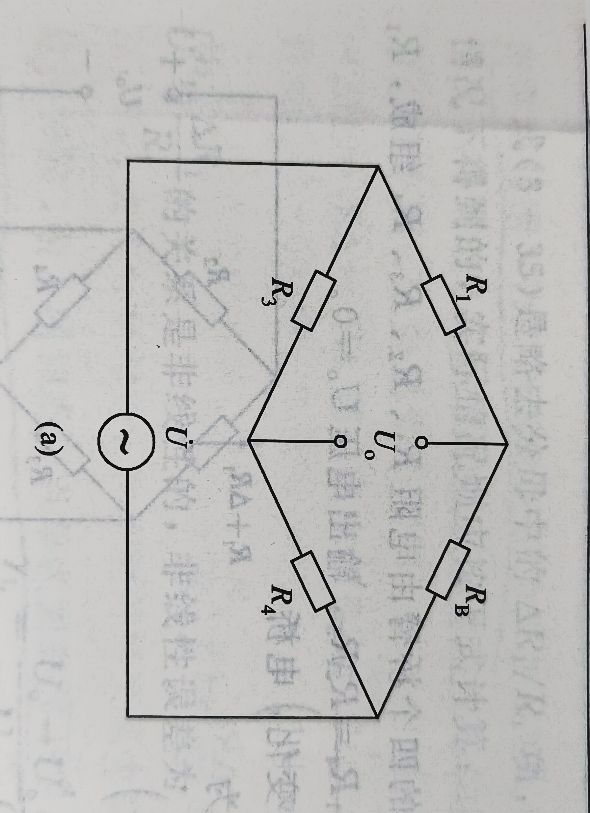  
            电桥输出电压$U_0$与桥臂参数的关系为
            $$U_0=A(R_1R_4-R_BR_3)$$  
            式中$A$由桥臂电阻和电源电压决定的常数。由上式可知，当$R_3$与$R_4$为常数时，$R_1$与$R_B$对电桥输出电压$U_0$的作用方向发展，利用这一关系即可实现对温度的补偿。
            测量应变时，工作应变片$R_1$粘贴在被测试件表面上，补偿应变片$R_B$粘贴在与被测试件完全相同的补偿块上，且仅由工作应变片承受应变，如图  
            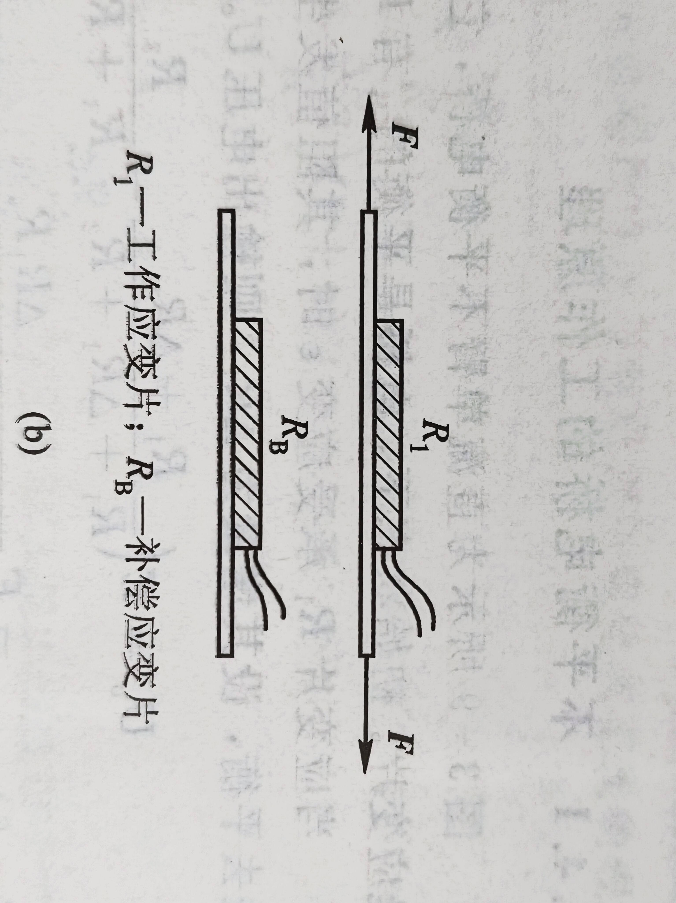  
            当被测试件不承受应变时，$R_1$和$R_B$又处于同一环境温度为$t$的温度场中，调整电桥参数使之达到平衡，此时有
            $$U_0=A(R_1R_4-R_BR_3)=0$$  
            工程上一般按$R_1=R_4=R_B=R_3$选取桥臂电阻  
            当温度升高或降低$\Delta t=t-t_0$时，两个应变片因温度相同而引起的电阻变化量相等，电桥仍处于平衡状态，即  
            $$U_0=A((R_1+\Delta R_{1t})R_4-(R_B+\Delta R_{Bt})R_3)=0$$ 
            若此时被测试件有应变$\varepsilon$的作用，则工作应变片电阻$R_1$有新的增量$\Delta R_1=R_1 K \varepsilon$，而补偿应变片不承受因不承受应变，故不产生新的增量，此时电桥输出电压为  
            $$U_0=AR_1R_4K\varepsilon$$  
            由上式可知，电桥的输出电压$U_0$仅与被测试件的应变$\varepsilon$有关，而与环境温度无关。
            应当指出，若要实现完全补偿，上述分析过程必须满足以下四个条件：
            1.  在应变片工作过程中，保证$R_3=R_4$
            2.  $R_1$与$R_B$两个应变片应具有相同的电阻温度系数$\alpha$，线膨胀系数$\beta$、应变灵敏系数$K$和初始电阻值$R_0$
            3.  粘贴补偿应变片的补偿块材料和粘贴工作应变片的被测试材料必须完全一致，两者的线膨胀系数相同
            4.  两应变片应处于同一温度场
        -   自补偿法：
            应变片的自补偿法是利用自身具有温度补偿作用的应变片（称之为温度自补偿应变片）来补偿的。
-   电阻应变式传感器测量电路（直流、交流）平衡条件及简单电路分析（单臂、半桥和全桥）？
    -   平衡条件
        -   直流电桥：  
            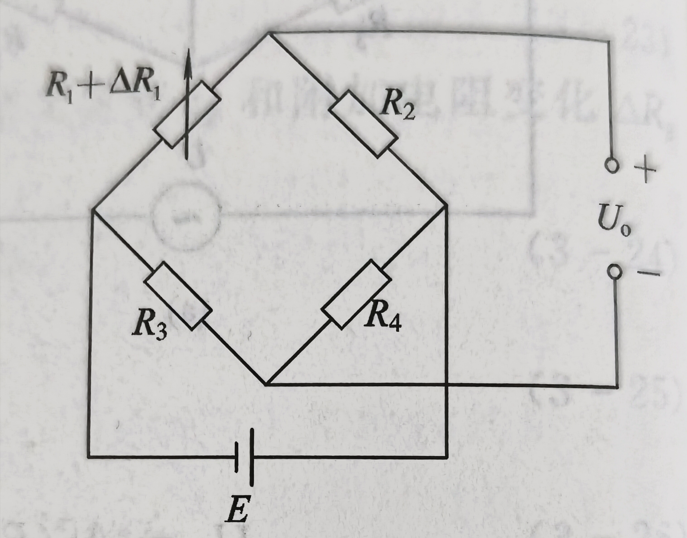  
            $$R_1 R_4=R_2 R_3$$
        -   交流电桥:  
              
            $$
            \frac{R_2}{R_1}=\frac{R_4}{R_3} \&\&
            \frac{R_2}{R_1}=\frac{C_1}{C_2}
            $$
    -   电路分析
        -   单臂
            对于单臂电桥，如图所示：  
              
            设桥臂比$n=R_2/R_1$，考虑到平衡条件$R_2/R_1=R_4/R_3$则：
            $$U_0=\frac{n}{{1+n}^2}\frac{\Delta R_1}{R_1}E$$
            电桥灵敏度定义为：
            $$K_U=\frac{n}{{1+n}^2}E$$
            分析可知：
            1.  电桥电压灵敏度正比于电桥供电电压，供电电压越高，电桥灵敏度越高，但供电电压受到应变片允许功率的限制，所以要选择适当
            2.  电桥电压的灵敏度是桥臂比$n$的函数，适当的选择桥臂比$n$的值，可保证电桥具有较高的灵敏度
            3.  当$E$确定后，$n$取1时，即$R_1=R_2=R_3=R_4$时，电桥的灵敏度最高，此时有
                $$U_0=\frac{E}{4} \frac{\Delta R_1}{R_1}$$ 
                $$K_U=\frac{E}{4}$$
        -   半桥
            为了减小和克服非线性误差，常采用差动电桥，在试件上安装两个工作应变片，一个受拉应变，另一个受压应变，接入电桥相邻桥臂，称为半桥差动电路，如图：  
              
            当$\Delta R_1=\Delta R_2,R_1=R_2,R_3=R_4$时，则得
            $$U_0=\frac{E}{2}\frac{\Delta R_1}{R_1}$$
            差动电桥无非线性误差，而且电桥电压灵敏度$K_U=E/2$，是单臂电桥工作时的两倍，同时还具有温度补偿作用。
        -   全桥
            若将电桥四臂接入四片应变片，如图：  
              
            即两个受拉应变，两个受压应变，将两个应变符号相同的接入相对桥臂上，构成全桥差动电路。
            若$R_1=R_2=R_3=R_4$且$\Delta R_1=\Delta R_2=\Delta R_3=\Delta R_4$时，则有
            $$U_0=E\frac{\Delta R_1}{R_1}$$
            $$K_U=E$$
            此时全桥差动电路不仅没有非线性误差，而且电压灵敏度为单片工作时的4倍，同时仍具有温度补偿作用。
        >**灵敏度对比**
        >|单臂|半桥|全桥|
        >|:---:|:---:|:---:|
        >|1|2|4|
### 热(敏)电阻热及其应用
-   金属热电阻工作原理、引线方式(三线制)及分度表使用？
    暂略
## 电感式传感器
### ==自感式传感器及应用==
-   ==回路磁阻计算==
    对于变隙式传感器，因为气隙很小，所以可以认为气隙中的磁场是均匀的。若忽略磁路磁损，则磁路总磁阻为
    $$R_m=\frac{l_1}{\mu_1+A_1}+\frac{l_2}{\mu_2+A_2}+\frac{2\delta}{\mu_0A_0}$$
    $\mu_1$——铁芯材料的导磁率
    $\mu_2$——衔铁材料的导磁率
    $l_1$——磁通通过铁芯的长度
    $l_2$——磁通通过衔铁的长度
    $A_1$——铁芯的截面积
    $A_2$——衔铁的截面积
    $\mu_0$——空气的导磁率
    $A_0$——气隙的截面积
    $\delta$——气隙的厚度
    通常气隙磁阻远大于铁芯与衔铁的磁阻，因而
    $$R_m=\frac{2\delta}{\mu_0A_0}$$
    联立上式可得
    $$L=\frac{W^2}{R_m}=\frac{W^2\mu_0A_0}{2\delta}$$
    $W$——线圈的匝数

-   自感式传感器的原理及分类
    -   ==变气隙==
    单边式变气隙式自感传感器如图所示，  
      
    设初始气隙为$\delta$，初始电感量为$L_0$,则有
    $$L_0=\frac{\mu_0A_0W^2}{2\delta_0}$$
    忽略展开后的高次项后可得：
    $$\frac{\Delta L}{L_0}=\frac{\Delta \delta}{\delta_0}$$
    灵敏度为：
    $$K_0=\frac{1}{\delta_0}$$
    根据上式可知，电感$L$与气隙厚度$\delta$的关系为非线性，仅有$\Delta \delta$很小的时候忽略高次项才可得近似的线性关系。==单边变气隙式自感传感器的测量范围与线性度及灵敏度相矛盾==。
    为了减小非线性误差，实际测量中广泛采用差动变气隙式自感传感器，其如下图所示：  
      
    差动变气隙式自感传感器要求上下两铁芯线圈的几何尺寸及电气参数完全对称。
    ==差动变气隙式自感传感器与单边变气隙式自感传感器相比较，非线性大大减小，灵敏度也提高了。==
    -   变面积
        变面积式自感传感器的结构如下图所示：  
          
        单边式结构在起始状态时，铁芯与衔铁正对，其截面积$A_0=ab$。当衔铁随被测体上下移动时，若移动量为$x$，则线圈电感$L$为
        $$L=\frac{W^2\mu_0b}{2\delta}(a-x)$$
        可见，线圈电感$L$与气隙面积$A$（或$x$）成线性关系。
        正确选择线圈匝数、铁芯尺寸，可有效提高灵敏度，如采用差动式结构则更好。
    -   变螺线管
        螺线管式自感传感器分为单线圈式和差动式两种结构形式，如图所示。
        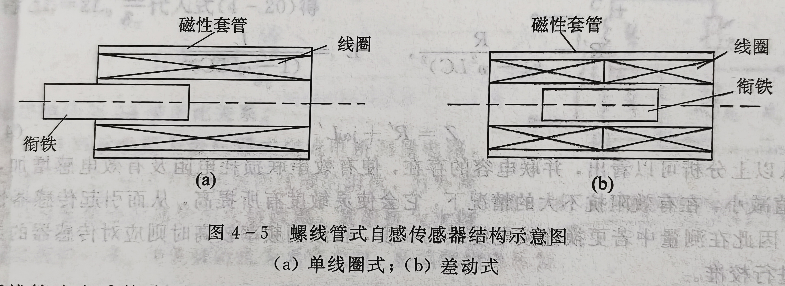  
        它由螺线管形线圈、柱形铁芯（衔铁）和磁性套管组成。磁性套管构成线圈的外部磁路，并作为传感器的磁屏蔽。随着衔铁插人深度的不同将引起线圈泄漏路径中磁阻的变化，从而使线圈的电感量发生变化。在实际应用中，该类传感器通常也采用差动结构，即将两个结构相同的自感线圈组合在一起，形成差动形式，以提高灵敏度和降低非线性程度。
-   ==三类传感器输出特性比较==
    在上述三种自感传感器中，变气隙式灵敏度最高，螺线管式灵敏度最低；
    变气隙式非线性严重，为了限制非线性，示值范围只能较小，它的自由行程受铁芯限制，制造装配困难，变面积式和螺旋管式的优点是具有较好的线性，因而示值范围可取大些，自由行程可根据需要调整，制造装配也较为方便；
    螺旋管式批量生产中的互换性好，其灵敏度低的情况也可通过放大电路方面加以解决，因此其应用越来越广泛。
-   等效电路及引线电缆
    等效电路如下图所示：  
    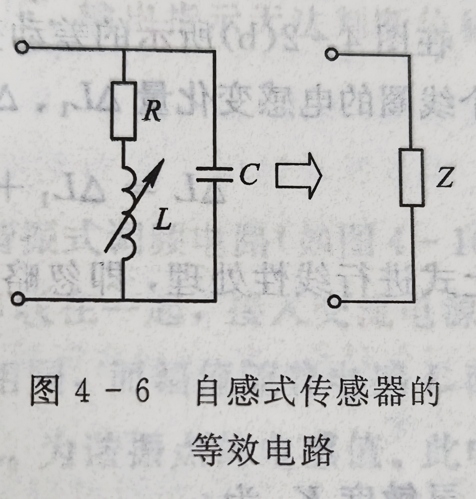  
    图中$L$为线圈的自感，$R$为折合成有功电阻的总电阻，$C$为并联寄生电容。其等效线圈阻抗为
    $$Z=\frac{(R+jwL)(\frac{-j}{wC})}{R+jwL-\frac{j}{wC}}$$
-   测量电路（交流/变压器电桥、调振）分析
    -   交流电桥式测量电路
        交流电桥式测量电路如下图所示：  
        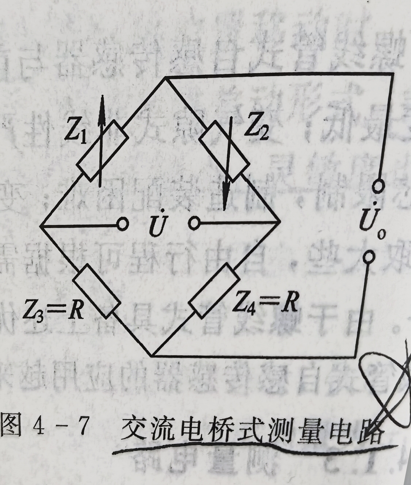  
        对结果进行线性处理，即忽略高次项得：
        $$\frac{\Delta L}{L_0}=2\frac{\Delta \delta}{\delta_0}$$
        灵敏度$K_0$为
        $$K_0=\frac{2}{\delta_0}$$ 
    -   变压器电桥:
          
        当负载阻抗为无穷大时，桥路输出电压为
        $$U_0=\frac{Z_2-Z_1}{Z_1+Z_2}*\frac{U}{2}$$
        当衔铁上/下移时，有$Z_1=Z\pm\Delta Z,Z_2=Z\mp\Delta Z$，此时： 
        $$U_0=\mp\frac{\Delta L}{L}\frac{U}{2}$$
    -   谐振式测量电路
        暂略
### ==互感式(差动变压器)传感器及应用==
-   ==零点残余电压产生原因及消除==
    我们把传感器在零位移时的输出电压称为零点输出电压，记为$\Delta U_0$
    零点残余电压的原因大致有如下两点：
    -   由于两电感线圈的==电气参数及导磁率几何尺寸不完全对称==，因此在两电感线圈上的电压幅值与相位不同
    -   由于传感器导磁材料磁化曲线的==非线性==（如铁磁饱和、磁滞损耗）使得激励电流与磁通波形不一致。  

    为了减小自感式传感器的零点残余电压，可采取以下措施：
    -   在设计和工艺上，力求做到磁路对称，铁芯材料均匀；
    -   在电路上进行补偿
-   测量电路(差动整流、相敏检波)分析
    -   差动整流电路
        暂略
    -   ==相敏检波==
    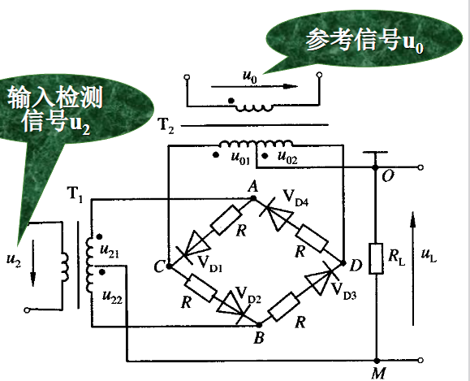
    u0 的幅值要远大于输入信号u2的幅值, 以便有效控制四个二极管的导通状态
    u0和u2由同一振荡器供电，保证二者同频、同相或反相。
### ==电涡流传感器及应用==
-   ==电涡流效应==
    根据法拉第电磁感应定律，块状金属导体置于变化的磁场中或在磁场中做切割磁力线运动时，导体内将产生漩涡状的感应电流，此电流叫电涡流。
-   测量电路分析
    暂略
-   ==工程应用（非接触测量）==
    - 厚度测量
    - 位移测量
    - 转速测量
    - 电涡流探伤
## 电容式传感器
### ==电容式传感器工作原理及分类==
-   电容式传感器的原理及分类（变极距、变面积和介电
常数）？
    由绝缘介质分开的两个平行金属板组成的平行电容器，如不考虑边缘效应，其电容量为
    $$C=\frac{\varepsilon A}{d}$$
    $\varepsilon$——两平行板间介质的介电常数，$\varepsilon=\varepsilon_0\varepsilon_r$，其中$\varepsilon_0$为真空介电常数，$\varepsilon_r$为板间介质的相对介电常数
    $A$——极板所覆盖的面积
    $d$——极板间的距离
    当被测参数变化使得式中的$A,d,\varepsilon$变化时，电容量$C$也随之变化。如果其中两个参数保持不变，而仅改变其中一个参数就可把该参数的变化转换为电容量的变化，通过测量电路输出。

    变极距式：仅改变d
    变面积式：仅改变A
    变介质式：仅改变$\varepsilon_r$
### ==变极距(面积、介质)型电容式传感器输出特性及比较==
-   电容式传感器线性度、灵敏度及差动结构？
    -   线性度：若$\frac{\Delta d}{d_0}<<1$时，简化为$$C=C_0+C_0\frac{\Delta d}{d_0}$$
    此时$C$、$\Delta d$近似为线性关系，所以变极距型电容式传感器只有在$\frac{\Delta d}{d_0}$很小时才有近似的线性关系。
    -   灵敏度：当$|\Delta d/d_0|<<1$时，通过近似的线性关系，可得电容式传感器的灵敏度为$$K=\frac{1}{d_0}$$
    它说明了单位输入位移所引起的输出电容相对变化的大小与$d_0$呈反比关系。
    -   差动结构：在实际应用中，为了提高灵敏度，减小非线性误差，大多采用差动式结构。在忽略高次项的情况下可得以下关系
    $$\frac{\Delta C}{C_0}=2\frac{\Delta d}{d_0}$$
    做成差动式结构后，灵敏度增加了一倍，而非线性误差则大大减小了。
### ==电容式传感器等效电路，测量电路==
-   电容式传感器测量电路分析
    -   运算放大器式
        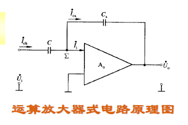
        $$U_0=-U_i\frac{c}{\varepsilon A}d$$
        运算放大器的输出电压与极板间距离 d 呈线性关系
    -   二极管双T型交流电桥
        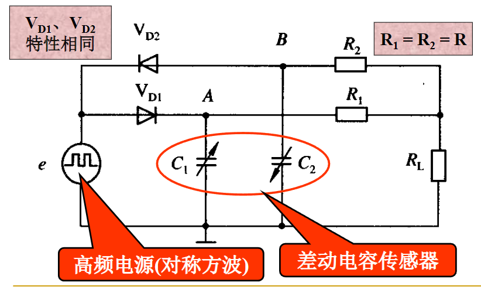
    -   脉宽调制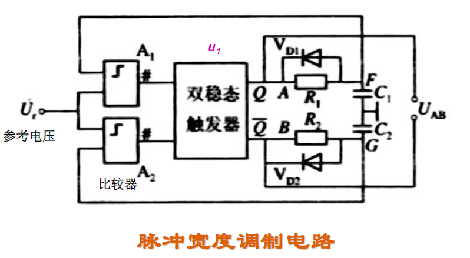

### 电容式传感器工程应用
-   电容式传感器工程应用范围？
    -   电容式压力传感器
    -   电容式加速度传感器
    -   差动式电容测厚传感器

## 压电式传感器
### ==压电式传感器的工作原理及压电材料==
-   正（反）压电效应及压电材料？
    压电效应：某些电介质，当沿着一定方向对其施力而使其变形时，内部就产生极化现象，同时在它的两个表面上产生符号相反的电荷，当外力去掉时，又重新恢复到不带电状态。
    逆压电效应：当在电介质极化方向施加电场时，这些电介质也会产生几何形变。
    **压电材料**：
    - 石英晶体：天然结构
    - 压电陶瓷：原始的压电陶瓷呈电中性，有一定的极化方向
    - 压电聚合物PVDF
-   石英晶体压电模型分析及方向轴定义？ 
    压电模型分析：
    ==方向轴定义==：
    石英晶体模型如图所示：  

    石英晶体有3个晶轴：x轴、y轴和 z轴。 z轴又称光轴，它与晶体的纵轴线方向一致：x 轴又称电轴，它通过六面体相对的两个棱线并 垂直于光轴：y轴又称为机械轴，它垂直于两 个相对的晶柱棱面。
-   压电陶瓷的==电畴极化==？
    压电陶瓷材料内部的晶粒有许多自发极化的电畴，它有一定的极化方向从而产生电场。
    在压电陶瓷上施加外电场时，电畴的极化方向发送转动，趋向于按外电场方向排列，从而使材料得到极化。外电场越强，就有越多的电畴更完全的转向外电场方向。让外电场强度大到使材料的极化达到饱和的程度，即所有电畴极化的方向都整齐的与外电场方向一致，当外电场去掉后，电畴极化的方向基本不发生变化，即剩余极化强度很大，这时材料才具有压电特性。
### ==压电式传感器的等效电路及串并联电路==
-   压电式传感器的预载力及动态测量？
    -   ==预载力==：压电传感器在测量低压力时线性度不好，这主要是由于传感器受力系统中力传递系数所致，即低压力下的力传递损失较大。为此在力传递系统中加入预加力，称为预载。
    -   动态测量：暂无
-   压电式传感器的电荷（压）等效电路及压电元件的连接特性（串联、并联）？
    等效电路：压电传感器可以看作一个电荷传感器，同时它也是一个电容器，晶体上聚集正负电荷的两个表面相当于电容的两个极板，极板间物质等效于一种介质，其电容量为：
    $$C_a=\frac{\varepsilon_r\varepsilon_0A}{d}$$
    $A$——压电片的面积
    $d$——压电片的厚度
    $\varepsilon_r$——压电材料的相对介电常数
    因此，压电式传感器可以等效为一个与电容相串联的电压源或者与电容并联的电流源
    电容器上的电压$u_a$、电荷量$q$和电容量$C_a$三者之间的关系为
    $$u_a=\frac{q}{C_a}$$
### ==压电式传感器的测量电路==
-   压电式传感器的测量电路特性及引线电缆？
    暂无
### 压电式传感器的工程应用
-   具体应用
    -   压电式测力传感器
    -   压电式加速度传感器
    -   压电式金属加工切削力测量
    -   压电式玻璃破碎传感器
    -   PVDF触觉传感器
## 磁电式传感器
### ==磁电感应式传感器及其应用==
-   ==工作原理==
    利用电磁感应原理将被测量（如振动、位移、转速等）转换成电信号。
-   ==分类==
    -   变磁通式：又称磁阻式
    -   恒磁通式
-   ==与电磁式传感器比较==
-   非线性误差及补偿
    由于传感器线圈内有电流$I$流过时，将产生一定的交变磁通$\Phi_1$，此交变磁通叠加在永久磁铁产生的工作磁通上，使恒定的气隙磁通变化
    补偿：在传感器中加入补偿线圈
-   温度误差补偿
    对于传感器来说，每摄氏度变化将引起金属丝的伸长。
    补偿：采用热磁分流器
-   ==测量电路==
    磁电感应式传感器直接输出感应电动势，且传感器通常具有较高的灵敏度，所以一般不需要高增益放大器。但磁电感应式传感器是速度传感器，若要获取被测位移或加速度信号，则需要配用积分或微分电路
### ==霍尔传感器及其应用==
-   ==霍尔效应==
    置于磁场中的静止载流导体，当它的电流方向与磁场方向不一致的时候，载流导体上垂直于电流和磁场的方向上产生电势差
-   ==霍尔电势==
    因为霍尔效应在导体两表面之间产生的电势差
-   ==霍尔元件==
    一块矩形半导体单晶薄片，引出四根导线：一对加激励电压或电流，另一对为霍尔输出引线，称为霍尔电极
-   ==不等位电势及其补偿==
    当霍尔元件的激励电流为$I$时，若元件所处位置磁感应强度为0，则它的霍尔电势应该为0，但实际不为零。
    这时测得的空载霍尔电势称为不等位电势
    补偿：分析不等位电势时，可以把霍尔元件等效成为一个电桥，用分析电桥平衡来补偿不等位电势
-   ==温度补偿方法==
    -   选用温度系数小的元件
    -   采用恒温措施
    -   采用恒流源供电
### 磁敏传感器及其应用
-   磁敏二极管和磁敏三极管
    暂缺
## 光电式传感器
### ==光电式传感器的工作原理==
-   内（外）光电效应？
    -   内光电效应：在光线作用下，物体的导电性能发生变化或产生光生电动势的效应
    -   外光电效应：在光线照射下，物体内的电子逸出物体表面向外发射的现象
### ==光电器件==
-   光电器件的特性？红限频率？
-   光电式传感器基本组成及类型？
    暂略
### 电荷耦合器件(CCD 传感器)
-   电荷耦合器件基本结构？分类？
    由若干个电荷耦合单元组成的，其基本单元是MOS光敏元。
    MOS光敏元的结构为金属——氧化物——半导体。
    分类：
    -   线性CCD图像传感器
    -   面型CCD图像传感器
### ==光纤传感器==
-   光纤的结构及==传光原理==（全反射）？
    光纤的结构：纤芯、包层和保护层
    传光原理：光在纤芯和包层的界面上反复逐次全反射呈锯齿波形状在纤芯内向前传播，最后从光纤的另一端面射出
-   光纤传感器的==工作原理==？
    

## 半导体传感器
### 气敏传感器
### 湿敏传感器
### 色敏传感器

## 超声波传感器
### 超声波
-   超声波的==频率范围==及分类？
    高于$2*10^4Hz$的机械波称为超声波
    分类：纵波、横波和表面波
-   超声波的反射与折射？
    暂略
### ==超声波传感器的工作原理==
-   超声波探头==工作原理及分类==？
    工作原理：利用压电材料的压电效应来工作的
    利用逆压电效应作为发射探头，而正压电效应作为接受探头
    分类：压电式、磁致伸缩式、电磁式
### ==超声波传感器的工程应用==
-   超声波传感器的工程应用？
    -   超声波物位传感器
    -   超声波流量传感器
    -   超声波无损探伤
    -   超声波测距

## 微波、辐射传感器
### 微波
-  反射式
-  遮断式
### 红外线

## 数字式传感器
### 数字式传感器特点
-   数字式传感器相对模拟式传感器的优点？
    -   测量精度和分辨率高
    -   稳定性好
    -   抗干扰能力强
    -   便于与微机接口
    -   适宜远距离传输
### ==编码器==
-   绝对编码器结构特点，==工作原理==，==码制==、特点及相互关系
    码制：二进制、十进制、格雷码等
-   增量编码器结构特点，==工作原理==
### ==光栅==
-   光栅分类，传感器结构，==莫尔条纹==及其特点，辨向原理，==细分技术==
    由两光栅不透光部分相互遮挡形成光线透不过的暗带，由此形成的光学图案称为莫尔条纹
    莫尔条纹特点：
    -   运动对应关系
    -   位移放大作用
    -   误差平均效应

## 传感器发展趋势
### 开发新型传感器
### ==传感器的集成化与多功能化==
### 智能化
### 仿生传感器
### 生物传感器
### 无线传感器网络与物联网

## 传感器在工程检测中的应用
### ==温度测量==
-   温度与温标
-   温度测量方法分类
-   ==热电偶测温原理==
    -   ==热电效应==
        两不同材料的导体（或半导体）组成一个闭合回路，当两接点温度不同时，则该回路中就会产生电动势
    -   ==热电偶基本定律==
        -   均质导体定律：
        -   中间导体定律：
        -   中间温度定律：
    -   ==分度表==
    -   ==补偿导线及冷端温度补偿==
### 压力测量
### 流量测量
### 物位测量
-   压力/流量/物位及表达方式（==电磁流量计==）
-   压力/流量/物位测量方法
   
## 智能仪表技术概述
### 仪表的发展历程
### ==智能仪表的分类、基本结构和功能==
-   智能仪表的基本结构：主机电路，过程输入输出通道，人机接口，通讯接口
### ==智能仪表的基本技术指标==
-   基本技术指标：
    -   测量范围
    -   上下限及量程
    -   零点迁移和量程迁移
    -   灵敏度和分辨率
    -   误差
    -   精确度
    -   滞环
    -   死区和回差
    -   重复性和再现性
    -   可靠性
### 智能仪表的设计开发过程
-   确定任务
-   拟制设计方案
-   硬/软件研制及仪表结构设计
-   仪表总调
-   性能测试
   
## 智能仪表硬件系统开发
### 主电路设计（MCU）
AT89C51、ARM系列单片机、DSP数字处理器
### 输入输出接口概述
数字量输入/输出接口、模拟量输入接口、模拟量输出接口
### 人机交互接口
键盘、输出设备（LED\LCD、打印机）
### 智能仪表数字化通信技术
串行通信、RS-232C、RS-422和RS-485、USB
### 现场总线技术与蓝牙技术
ModBus现场总线、CAN总线、Profibus总线、基金会现场总线(FF总线)、LonWorks、工业以太网、工业无线网络、蓝牙通信技术

## 智能仪表软件系统开发
### 软件设计方法
- 软件开发一般经历分析、设计、编程、测试及运行与维护等阶段。
- 软件设计部分主要是设计软件系统的模块层次结构、控制流程及数据库的结构等。
-  这个阶段可以分为两个部分，即总体设计和详细设计。
-  目前广泛采用的设计方法主要是结构化设计和结构化编程。
### 软件功能测试
-   常用的方法有==功能测试法==和==程序逻辑结构测试法==
-   测试的基本原则
### 软件的运行、维护和改进
### 监控程序设计
### ==主要模块程序设计==
-   监控主程序
-   初始化管理
-   键盘管理
-   显示管理
-   中断管理
-   时钟管理
-   手自动控制
-   自诊断处理
   
## 实验/综合题
### 模拟量电感式传感器（材质/尺寸）
### 模拟量光电式漫射传感器（颜色/粗糙度/厚度）
### 工业力传感器实验（1/4、半、全桥(调零)/未知力）
### 模拟量压力传感器（压力校准/力与压力转换（调零））

## 计算题
|模块|题目|
|:---:|:---:|
测量数据估计   |     P25  1-11,12,14 
电阻式传感器   |     P58  3-5,6,7 
电感式传感器   |     P81  4-5,7,8 
电容式传感器   |     P96  5-4,5 补充题
数字式传感器   |     补充题
热电偶         |           P276  15-7,8